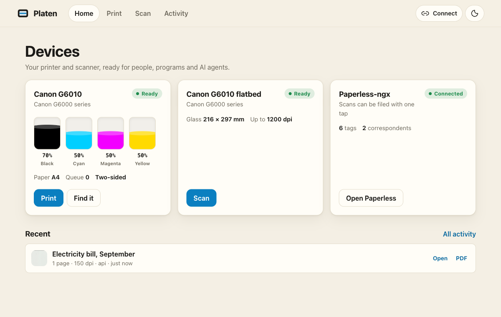
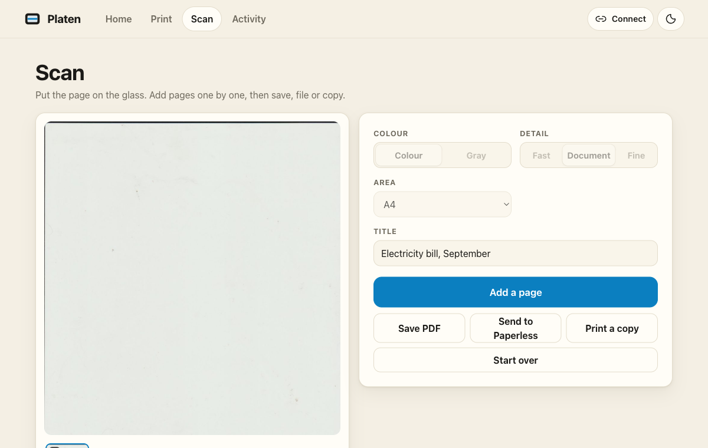

# Platen

**Your printer and scanner, for people, programs and AI agents.**

Platen is a small server that sits next to a network printer and scanner and gives them three front doors:

- a **web interface** for phones and laptops (print a file, scan a document, make a copy);
- a **REST API** for scripts and home automation;
- a built-in **MCP server**, so AI agents such as Claude can print, scan and read paper.

It can also file what you scan in [Paperless-ngx](https://github.com/paperless-ngx/paperless-ngx), and print documents from it.

It is one static binary. It needs no CUPS, no SANE, no Ghostscript and no drivers: it speaks the printer's and scanner's own network protocols (IPP and eSCL) and renders PDFs itself.



> **Status: early.** Version 0.1 works end to end and has a test suite, but it has been used with one printer model so far (see [Tested with](#tested-with)). Reports from other devices are very welcome.

Download binaries for Linux, macOS and Windows from [Releases](https://github.com/giovannirco/platen/releases). See the [changelog](CHANGELOG.md) for changes and the [upgrade guide](docs/deployment.md) for existing installations.

## Why

Three things were missing at my house:

1. **My printer refuses PDFs.** Like most inkjets, it only accepts pictures and raster formats. Phones hide this (AirPrint converts on the phone), but a script, a home-automation flow or an AI agent that has a PDF is stuck. Platen renders the PDF and sends the printer what it understands.
2. **Scanning needed an app on one particular computer.** Platen scans from any browser, builds a multi-page PDF from a flatbed, and sends it to Paperless.
3. **Agents have no hands.** With Platen's MCP server an agent can print a document, scan the page you put on the glass, read it, and file it under a sensible title.

## What it does

**Print**

- PDF, JPEG, PNG, GIF, TIFF, WebP, BMP and plain text; from an upload, a URL, a Paperless document, an earlier scan, or a file path you allow.
- Works with printers that take PDF (sent untouched) and with printers that don't (rendered in-process and sent as PWG Raster).
- Copies, two-sided printing (including the back-side rotation raster printers ask for), colour or black, draft/normal/high quality, paper size, page ranges.
- Ink or toner levels, paper, printer state and queue.
- **Guard rails**: a job above a sheet threshold needs a confirmation; hard limits on sheets and copies; a dry run that reports pages and sheets without printing.

**Scan**

- Flatbed and document feeder, colour or gray, 75 to 1200 dpi, common paper sizes or a custom area.
- Multi-page documents from a flatbed: add pages one by one, reorder or remove them, get one PDF.
- Photocopy: scan, then print.

**Paperless-ngx**

- File a scan with title, tags, correspondent, document type and document date (missing tags are created).
- Search Paperless and print a document from it.

**For agents (MCP)**

- Ten tools with output schemas and annotations; scans come back as pictures the model can read.
- Asks the *person* (not the model) before using a lot of paper, and between flatbed pages, through the protocol's elicitation mechanism.
- Stateless Streamable HTTP endpoint (protocol revision 2026-07-28) and stdio; older clients work too.
- Two interactive views for hosts that support MCP Apps: printer status with ink gauges, and the scanned page with "scan next page".

## Quick start

### 1. Find your devices

You need the printer's IPP address and the scanner's eSCL address. For a multifunction printer both are usually on its IP address:

```
ipp://<printer-ip>/ipp/print       # printing
http://<printer-ip>/eSCL           # scanning
```

A CUPS queue works as a printer too: `ipp://<cups-host>:631/printers/<queue>`.

### 2. Run it

With Go 1.27 or newer:

```sh
go install github.com/giovannirco/platen/cmd/platen@latest

PLATEN_PRINTER_URI=ipp://192.0.2.20/ipp/print \
PLATEN_SCANNER_URL=http://192.0.2.20/eSCL \
platen check          # talks to the devices and reports what they can do
platen serve          # then open http://localhost:8080
```

Or with a configuration file (see [`platen.example.yaml`](platen.example.yaml)):

```sh
cp platen.example.yaml platen.yaml   # edit it
platen serve -config platen.yaml
```

With Docker:

```sh
docker run --rm -p 8080:8080 -v platen-data:/data \
  -e PLATEN_PRINTER_URI=ipp://192.0.2.20/ipp/print \
  -e PLATEN_SCANNER_URL=http://192.0.2.20/eSCL \
  -e PLATEN_BASE_URL=http://<this-host>:8080 \
  ghcr.io/giovannirco/platen:0.1.1
```

Examples for Docker Compose and Kubernetes are in [`deploy/`](deploy/).

`platen check` is the first thing to run. It prints what Platen sees:

```
✓ printer inkjet (Living-room inkjet): Canon G6000 series, idle
    accepts:  application/octet-stream, image/jpeg, image/urf, image/pwg-raster
    raster:   [600] dpi, srgb_8, sgray_8
    paper:    loaded A4; duplex true; colour true
    ink:      Black(PGBK)    70%
    ...
    note:     this printer does not accept PDF; Platen renders PDFs itself and sends raster.
✓ scanner flatbed (Living-room scanner): Canon G6000 series, Idle
    sources:  flatbed; up to 216 x 297 mm
```

For scripts and agents, request a JSON report:

```sh
platen check -json -config platen.yaml > check.json
```

The report contains `ok`, `failed_checks`, `printers`, `scanners` and `paperless`.
Device results include `online`, capabilities and an `error` when unreachable;
Paperless includes `enabled`, `online`, its public URL and metadata counts
(`tag_count`, `correspondent_count`, `document_type_count`). No configured tokens
are included. Unconfigured devices are empty arrays, and an unconfigured
Paperless instance is disabled; neither counts as a failure.

The command exits **0** when all configured services answer, or **1** when a check
fails. A failed check still produces the full JSON report on stdout, with a
summary on stderr. `ok` reports connectivity; inspect the printer's `state` and
`accepting_jobs` to see whether it is ready to print. Startup errors, such as an
invalid configuration, go to stderr before a report is produced.

### 3. Protect it

Without a token, anyone who can reach Platen can print and scan. Set at least one token:

```sh
export PLATEN_AUTH_TOKENS="$(openssl rand -hex 24)"
```

The web interface asks for it once; scripts and agents send `Authorization: Bearer <token>`.

At home you may not want the family to type a token on their phones. List the home network as trusted, and everything else still needs one:

```yaml
auth:
  tokens: ["<token for agents and scripts elsewhere>"]
  trusted_networks: ["192.168.1.0/24"]
```

If a reverse proxy stands in front of Platen, name it in `server.trusted_proxies`, or every request looks as if it came from the proxy and none is trusted.

## Connect an AI agent

Platen's MCP endpoint is `http://<platen>/mcp`.

**Claude Code**

```sh
claude mcp add --transport http platen http://platen.lan:8080/mcp \
  --header "Authorization: Bearer <token>"
```

**Any client that starts local programs** (stdio):

```json
{
  "mcpServers": {
    "platen": { "command": "platen", "args": ["mcp", "-config", "/path/to/platen.yaml"] }
  }
}
```

Then just ask: *"Scan the page on the printer and tell me what it is"*, *"File it in Paperless"*, *"Print my last electricity bill, two-sided"*.

| Tool | What it does |
|---|---|
| `list_devices` | Printers, scanners and whether Paperless is connected |
| `printer_status` | State, ink levels, paper, queue (with an interactive view) |
| `print_document` | Print from a URL, Paperless, a scan, text, a file or inline content; `dry_run` reports pages and sheets |
| `list_print_jobs` / `cancel_print_job` | History and cancelling |
| `scan_document` | Scan a page and return it as a picture and a PDF; `scan_id` adds a page to the same document |
| `list_scans` / `delete_scan` | Scans held by Platen |
| `file_scan_in_paperless` | File a scan with title, tags, correspondent, type and date |
| `search_paperless` | Find documents to print |

There are also two prompts (`scan_and_file`, `print_carefully`) and resources for scanned documents (`platen://scans/{id}/document`). Print a scan by passing its `scan_id` to `print_document`; Platen builds the PDF from the current pages automatically.

**Who decides to use paper?** When a job needs more sheets than `limits.confirm_above_sheets`, Platen asks the person at the client, not the model: the tool call returns an input request, the client shows the question, and the call is retried with the answer (multi round-trip requests, MCP 2026-07-28). The state that travels with the question is signed, so a confirmation counts only for the job it was given for. With a client that can't show questions, the model is told to ask and to repeat the call with `confirm: true`.

More in [docs/mcp.md](docs/mcp.md).

## Use it from scripts

```sh
# Print a PDF, two-sided
curl -F file=@report.pdf -F duplex=long-edge http://platen.lan:8080/api/v1/print

# How much paper would it take?
curl -F file=@report.pdf -F dry_run=true http://platen.lan:8080/api/v1/print

# Scan the glass and download the PDF
id=$(curl -s -X POST -H 'Content-Type: application/json' -d '{"resolution":300}' \
     http://platen.lan:8080/api/v1/scans | jq -r .id)
curl -OJ http://platen.lan:8080/api/v1/scans/$id/document

# File it in Paperless
curl -X POST -H 'Content-Type: application/json' \
  -d '{"title":"Electricity bill","tags":["bills"],"wait":true}' \
  http://platen.lan:8080/api/v1/scans/$id/paperless
```

The full API is described at `/api/openapi.json`. The command line can print and scan too: `platen print report.pdf`, `platen scan -out bill.pdf -paperless`.

If a printer is busy and refuses a job, the API returns HTTP 409 with error code `busy`. The document was not accepted; wait for the printer to finish before submitting it again. Once a job is accepted, follow its status in Activity. A failed history refresh does not mean the print failed.



## How it works

```
 browser ─┐                        ┌─ IPP ──────────► printer (PDF, JPEG or PWG Raster)
 scripts ─┼─► Platen (one binary) ─┼─ eSCL ─────────► scanner (JPEG pages)
 agents  ─┘   web · REST · MCP     └─ REST ─────────► Paperless-ngx
```

- **Printing** uses IPP, the protocol behind AirPrint, Mopria and IPP Everywhere. Platen asks the printer what it accepts. A PDF goes to a PDF-capable printer untouched. For a raster-only printer, pages are rendered by PDFium (compiled to WebAssembly and run in-process by [wazero](https://github.com/tetratelabs/wazero), so there is no C dependency) and streamed as PWG Raster, one page at a time.
- **Scanning** uses eSCL, the protocol behind AirScan and Mopria Scan: plain HTTP and XML.
- **Paperless** is reached through its REST API.
- **Storage** is a directory of plain files: scans and a JSON print history.

More in [docs/how-it-works.md](docs/how-it-works.md).

## Security

- Set `auth.tokens`. The token protects the API, the MCP endpoint and the web interface. `auth.trusted_networks` lets named networks in without one.
- A request that gets in without a token is only served under a host name Platen knows (protection against DNS rebinding), and cross-site browser requests are refused.
- Printing by URL does not reach private, loopback or link-local addresses unless you allow it (`fetch.allow_private_networks`), so Platen can't be used to read your internal network.
- Printing files by path is off until you list directories in `fetch.allowed_dirs`; hidden files are never read.
- A printer is a physical thing: the sheet limits exist so that a confused agent or script can't empty the paper tray.

## Tested with

| Device or software | Notes |
|---|---|
| Canon PIXMA G6010 / G6000 series | Raster-only printer (no PDF), duplex, eSCL flatbed. Printing, scanning and ink levels verified on the real device |
| CUPS 2.4 queue | PDF passthrough |
| Paperless-ngx 3.2 | Filing, search, printing a stored document |
| Go MCP SDK 1.8 clients | stdio and stateless HTTP, protocol 2026-07-28 |
| MCP Inspector (TypeScript SDK) | every tool, prompt and resource over HTTP |
| MCP Apps reference host (ext-apps 2.0) | both views, with calls from the view back to Platen |

Platen should work with any printer that supports IPP with PDF, JPEG or PWG Raster, and any eSCL scanner. If yours behaves differently, please open an issue with the output of `platen check`.

Known limits: Office documents are not converted (print them to PDF first); a document feeder is supported by the code but has not been tested on hardware; URF (Apple Raster) is not implemented because every tested printer also takes PWG Raster.

## Development

```sh
go test ./...        # runs against fake devices: an IPP printer, an eSCL scanner and a Paperless instance
go run ./cmd/platen serve -config platen.yaml -debug
```

The fakes in `internal/testutil` speak the real protocols over HTTP, so the tests exercise the same code paths as hardware does. `platen print -dump out.pwg file.pdf` writes what would be sent to the printer instead of printing, which helps when a printer rejects a job.

## Related projects

Platen stands on protocols and ideas from projects worth knowing: [CUPS](https://github.com/OpenPrinting/cups) and [PAPPL](https://github.com/michaelrsweet/pappl) (printing), [sane-airscan](https://github.com/alexpevzner/sane-airscan) and [scanservjs](https://github.com/sbs20/scanservjs) (scanning), [Paperless-ngx](https://github.com/paperless-ngx/paperless-ngx), [go-pdfium](https://github.com/klippa-app/go-pdfium), [goipp](https://github.com/OpenPrinting/goipp) and the [MCP Go SDK](https://github.com/modelcontextprotocol/go-sdk).

## License

[MIT](LICENSE)
